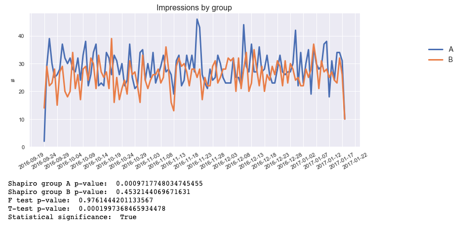

# AlphaB

## Python library for rendering charts and computing statistics for A/B testing

### Current state

This library is in the very initial state. Currently, it supports only A/B testings (two groups).

### AlphaB allows you to:

* Automatically generate charts from A/B testings
* Compute statistics in order to confirm a statistical significance between groups


## Table of content

* [Requirements](#requirements)
* [How to use it](#how-to-use-it)

## Requirements

You can directly install all of the requirements for AlphaB by running `pip install -r requirements.txt` from the root of the repository.

* [Matplotlib](https://matplotlib.org/) - a library to generate charts from data sets
* [Pandas](https://pandas.pydata.org/) - a library providing high-performance, easy-to-use data structures and data analysis tools
* [Numpy](https://numpy.org/) - a library providing support for large, multi-dimensional arrays and matrices, along with a large collection of high-level mathematical functions
* [Scipy](https://www.scipy.org/) - a library used for scientific computing and technical computing
* [Pathlib](https://docs.python.org/3/library/pathlib.html) - offers a set of classes to handle filesystem paths

```python
import pandas as pd
import numpy as np
import matplotlib.pyplot as plt
from scipy import stats
from pathlib import Path
```

## How to use it

It is highly recommended to use [Jupyter](https://jupyter.org/) to perform A/B testing analysis in Python, and AlphaB is built to be used in Jupyter Notebooks. 

Here is an example usage for AlphaB (this example doesn't include specifying a data set for now):

```python
#!/usr/bin/env python3

from alphab import BucketTest
import pandas as pd


def main():
    df = pd.DataFrame()
    bucket_test = BucketTest(
        df=df,
        variable='impressions',
        group='design',
        x_axis='date',
        custom_title='Impressions by design',
        custom_ylabel='#',
        custom_day_interval=1
    )
    bucket_test.render()
    bucket_test.compute_pvalues()
```

### Arguments

When creating a bucket test, you can specify the following arguments:

* `df` - data frame to be used for the bucket test. It is recommended to group the data frame before passing it (e.g.: When doing a bucket test on the group `design`, you should group the data frame by design and date first)
* `variable` - specifies the values on the y-axis for the chart and statistical significance check
* `group` - the name of the column which the data frame is grouped by
* `x_axis` (default: `date`) - specifies the values on the x_axis for the chart
* `custom_title` (default: `{variable} per {group}`) - specifies the title for the chart

For the `render()` method, those options can be specified to customize your chart:

* `figure_size_x` (default: 12) - the width of the chart (in inches)
* `figure_size_y` (default: 5) - the height of the chart (in inches)
* `line_width` (default: 3) - the line width in a line chart (in points)
* `title_font_size` (default: 16) -  the font size of the title in the figure 
* `legend_font_size` (default: 14) -  the font size of the legend in the figure

In the `compute_pvalues()` method, you can customize the p-value used to reject a null hypothesis by adjusting the `alpha` value (default: `0.01`).
Recommended values are: `0.01`, `0.05`, `0.1`.
Read more about statistical significance and p-value [here](https://www.statsdirect.com/help/basics/p_values.htm).
[This research paper](http://www.scielo.br/pdf/bpsr/v7n1/02.pdf) is also a good place to start for those who want to better understand those topics.

### Screenshots

A generated chart and statistical significance analysis example:

<p align="center">
  
</p>

## Next steps

* Customize the number of groups that are taken into account A/B/C testings, A/B/C/D testings, A/B/C/D/E testings
* Render charts and compute p-values for data from more than one data frame
* Create tests for `render` and `compute_pvalue` methods
* Handle other `x_axis` that date only
* Customize names of images `plt.savefig(Path(""))`

## How to contribute

You can contribute by forking this repository, looking through the [issues](https://github.com/Wikia/AlphaB/issues) of the repository, and opening a PR on your fork. Please make sure to write a clear PR description and to provide examples for how your new feature works.

## Contributors

* The method for checking statistical significance was highly inspired by the work of **Paulina Gralak [@Loczi94](https://github.com/Loczi94)**.

Thanks a lot!

The creator and maintainer: Julia Jakubczak [@veliona](https://github.com/veliona)
